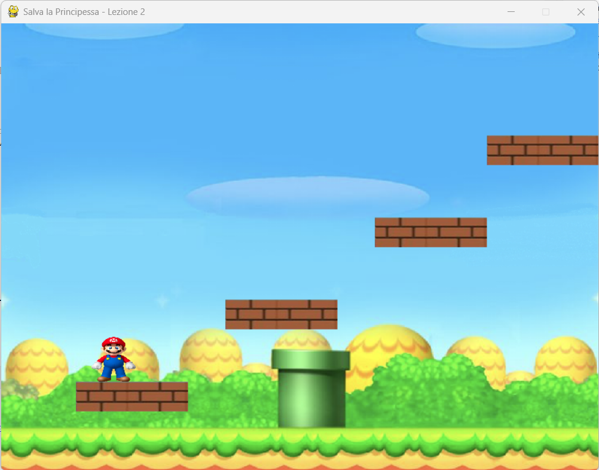

# Lezione 2: Aggiungere Mario, la Gravità e le Piattaforme (Versione Approfondita)

# Immagini


## Introduzione

Benvenuto alla **Lezione 2** del corso *Salva la Principessa*!  
Nella lezione precedente hai imparato a creare una finestra con Pygame e impostare uno sfondo.  
Ora daremo vita al gioco aggiungendo:

- Il personaggio di **Mario**, controllabile con la tastiera.
- Un sistema di **gravità** realistico.
- La possibilità di **saltare e camminare**.
- Alcune **piattaforme** su cui Mario può atterrare.

In questa lezione iniziamo a costruire le basi della fisica del gioco, passo essenziale per rendere il movimento realistico e stabile.

---

## Obiettivi della Lezione

- Comprendere il concetto di coordinate e rettangoli (`Rect`) in Pygame.  
- Applicare una gravità costante e gestire i salti.  
- Implementare piattaforme solide e collisioni corrette.  
- Mantenere lo stesso stile visivo e proporzioni del gioco completo.

---

## Concetti Teorici Fondamentali

### 1. Coordinate in Pygame

In Pygame, il punto **(0,0)** si trova in **alto a sinistra** dello schermo:  
- l’asse **x** cresce verso destra,  
- l’asse **y** cresce verso il basso.  

Ogni immagine o oggetto è rappresentato da un **rettangolo (Rect)** che definisce posizione e dimensioni.  
I `Rect` sono anche usati per rilevare **collisioni**, grazie a metodi come `colliderect()`.

### 2. Gravità e Velocità Verticale

Per simulare la gravità, usiamo una variabile `vel_y` che rappresenta la velocità verticale del giocatore.  
A ogni frame aggiungiamo una costante `GRAVITY` a `vel_y`, poi aggiorniamo la posizione `y` di Mario:

```python
vel_y += GRAVITY
player.y += int(vel_y)
```

Quando Mario salta, impostiamo `vel_y` a un valore negativo (es. `-JUMP_POWER`), e la gravità lo riporterà giù gradualmente.

### 3. Collisioni con Piattaforme

Per evitare che Mario attraversi il terreno o le piattaforme, verifichiamo se il suo `Rect` collide con quello delle piattaforme.  
In caso di collisione, correggiamo la posizione e azzeriamo la velocità verticale, simulando l’impatto con il suolo.

---

## Preparazione del Progetto

Assicurati di avere nella tua cartella di progetto `salva_la_principessa` i seguenti file:

- `sfondo.png` → lo sfondo del livello  
- `mario.png` → il personaggio principale  
- `blocco.png` → immagine per le piattaforme  

Ora crea un nuovo file Python chiamato **lesson_2.py**.

---

## Codice Completo della Lezione 2

Copia il codice seguente in `lesson_2.py`:

```python
import pygame
import sys

# --- Inizializzazione ---
pygame.init()

# --- Costanti di Gioco ---
WIDTH, HEIGHT = 800, 600
FPS = 60

# Parametri fisici
GRAVITY = 0.8
JUMP_POWER = 20
SPEED = 5

# --- Colori ---
WHITE = (255, 255, 255)
BLACK = (0, 0, 0)
BROWN = (150, 90, 40)

# --- Setup Finestra ---
screen = pygame.display.set_mode((WIDTH, HEIGHT))
pygame.display.set_caption("Salva la Principessa - Lezione 2")
clock = pygame.time.Clock()

# --- Caricamento Immagini ---
background = pygame.image.load("sfondo.png").convert()
background = pygame.transform.scale(background, (WIDTH, HEIGHT))

mario_img = pygame.image.load("mario.png").convert_alpha()
mario_img = pygame.transform.scale(mario_img, (60, 60))

block_img = pygame.image.load("blocco.png").convert_alpha()
block_img = pygame.transform.scale(block_img, (150, 40))

# --- Definizione Oggetti di Gioco ---
player = pygame.Rect(50, HEIGHT - 150, 60, 60)
vel_y = 0
on_ground = False

# --- Creazione Piattaforme ---
platforms = [
    pygame.Rect(100, 480, 150, 40),
    pygame.Rect(300, 370, 150, 40),
    pygame.Rect(500, 260, 150, 40),
    pygame.Rect(650, 150, 150, 40),
]

# --- Ciclo Principale di Gioco ---
running = True
while running:
    dt = clock.tick(FPS)

    # Gestione Eventi
    for event in pygame.event.get():
        if event.type == pygame.QUIT:
            running = False

    # Input da Tastiera
    keys = pygame.key.get_pressed()
    if keys[pygame.K_LEFT]:
        player.x -= SPEED
    if keys[pygame.K_RIGHT]:
        player.x += SPEED
    if keys[pygame.K_SPACE] and on_ground:
        vel_y = -JUMP_POWER
        on_ground = False

    # Gravità
    vel_y += GRAVITY
    player.y += int(vel_y)

    # Collisioni con le Piattaforme
    on_ground = False
    for platform in platforms:
        if player.colliderect(platform):
            # Se cade sulla piattaforma
            if vel_y > 0 and player.bottom - vel_y <= platform.top:
                player.bottom = platform.top
                vel_y = 0
                on_ground = True
            # Se colpisce dal basso
            elif vel_y < 0 and player.top - vel_y >= platform.bottom:
                player.top = platform.bottom
                vel_y = 0

    # Pavimento (bordo inferiore)
    if player.bottom >= HEIGHT:
        player.bottom = HEIGHT
        vel_y = 0
        on_ground = True

    # Limiti Laterali
    if player.left < 0:
        player.left = 0
    if player.right > WIDTH:
        player.right = WIDTH

    # --- Disegno su Schermo ---
    screen.blit(background, (0, 0))
    for platform in platforms:
        screen.blit(block_img, (platform.x, platform.y))
    screen.blit(mario_img, (player.x, player.y))

    pygame.display.flip()

pygame.quit()
sys.exit()
```

---

## Spiegazione del Codice

### 1. Gravità e Salto
Il parametro `GRAVITY` definisce l’accelerazione verso il basso.  
Ogni frame, `vel_y` aumenta e viene sommato alla posizione `y` del giocatore.

Il salto avviene impostando `vel_y` a un valore negativo. Quando `on_ground` è `True`, Mario può saltare; in aria, no.

### 2. Collisioni Verticali
Controlliamo se Mario entra in contatto con una piattaforma tramite `player.colliderect(platform)`.
- Se la collisione avviene **dall’alto**, fermiamo la caduta e posizioniamo Mario esattamente sopra la piattaforma.  
- Se la collisione avviene **dal basso**, blocchiamo la salita e annulliamo la velocità.

### 3. Controllo dei Bordi
Impediamo al giocatore di uscire dallo schermo, controllando `player.left` e `player.right`.

### 4. Frame Rate
`clock.tick(FPS)` mantiene la velocità di aggiornamento costante.  
Con 60 FPS, il movimento risulterà fluido e naturale.

---

## Challenge 

1. **Crea più piattaforme:** aggiungi nuove righe alla lista `platforms`.  
2. **Cambia la gravità:** prova valori tra `0.5` e `1.2` per vedere come cambia la sensazione del salto.  
3. **Aggiungi suono al salto:** usa `pygame.mixer.Sound("salto.wav").play()`.  
4. **Disegna contorni di debug:** usa `pygame.draw.rect(screen, (255,0,0), player, 2)` per vedere i `Rect`.  

---

## Riepilogo

In questa lezione abbiamo imparato a:

- Gestire movimento e salto del personaggio.  
- Applicare la gravità.  
- Implementare piattaforme e collisioni verticali.  
- Mantenere il controllo stabile dei bordi dello schermo.

Nella **Lezione 3**, aggiungeremo i **gusci cadenti**, il **sistema di vite**, e la logica di **game over**.

[Continua alla Lezione 3 →](Lezione_3.md)
