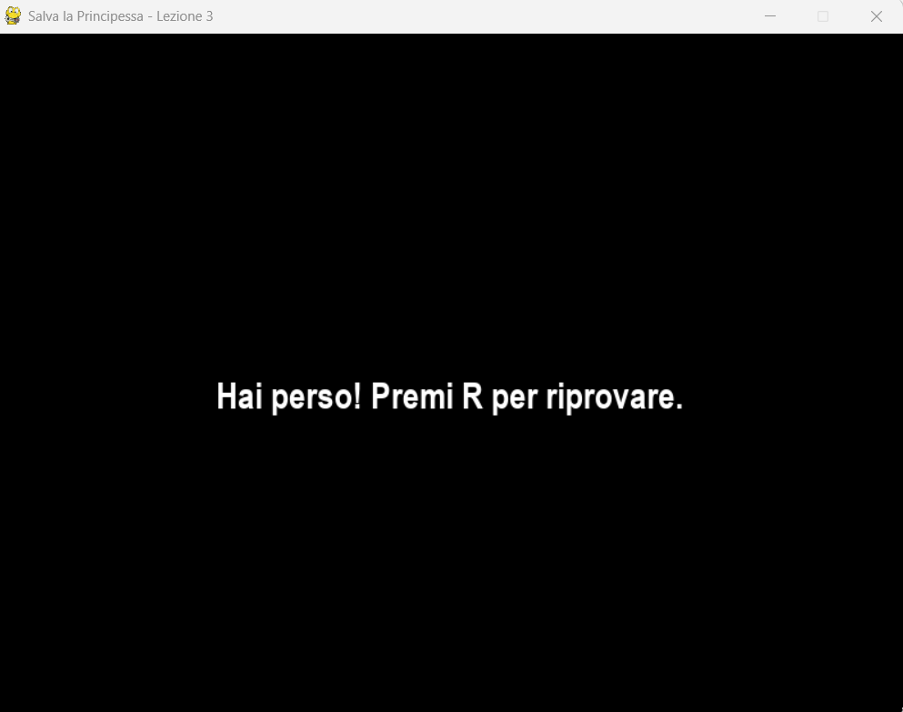

# Lezione 3: Aggiungere i gusci cadenti e il sistema di vite

# Immagini



## Introduzione

Nella **Lezione 2** abbiamo creato un mondo interattivo con **Mario**, la **gravità** e le **piattaforme**.  
Ora il gioco comincia a diventare più interessante: in questa lezione aggiungeremo gli **ostacoli cadenti**, cioè i **gusci** lanciati da Donkey Kong, e un **sistema di vite** che riduce la salute del giocatore ogni volta che viene colpito.

Alla fine della lezione, il gioco avrà:
- Gusci che cadono dall’alto a intervalli regolari.
- Collisioni tra i gusci e Mario.
- Un sistema di **vite rimanenti** visualizzato graficamente sullo schermo.
- Una logica di **Game Over** quando le vite terminano.

---

## Obiettivi didattici

- Generare oggetti casuali (gusci) con velocità e posizione variabili.  
- Gestire collisioni tra il player e i gusci.  
- Implementare un sistema di vite con grafica dedicata.  
- Bloccare il gioco quando tutte le vite sono esaurite.  
- Comprendere la gestione del tempo con `pygame.time.get_ticks()`.

---

## Concetti chiave

### 1. Generazione casuale di oggetti
Utilizziamo il modulo `random` per determinare la posizione orizzontale e la velocità dei gusci:
```python
import random
x_pos = random.randint(0, WIDTH - 40)
speed = random.randint(DROP_SPEED_MIN, DROP_SPEED_MAX)
````

Questo ci permette di creare un’esperienza di gioco dinamica e imprevedibile.

### 2. Timer e gestione del tempo

Con `pygame.time.get_ticks()` otteniamo il numero di millisecondi trascorsi dall’avvio del gioco.
Questo valore è utile per decidere **quando generare un nuovo guscio**:

```python
if now - last_drop_time > DROP_SPAWN_TIME:
    # genera nuovi gusci
```

### 3. Sistema di vite

Le vite del giocatore vengono memorizzate in una variabile (`vite`) e rappresentate graficamente come **icone** (ad esempio dei funghi o cuori):

```python
vite = MAX_VITE
```

Ogni volta che Mario viene colpito da un guscio, `vite` diminuisce di 1.
Quando raggiunge 0, appare la schermata di **Game Over**.

---

## Risorse necessarie

Assicurati di avere nella tua cartella del progetto:

* `guscio.png` — l’immagine del guscio cadente
* `fungo.png` (o `cuore.png`) — icona per le vite
* Gli altri file già presenti: `sfondo.png`, `mario.png`, `blocco.png`

---

## Codice completo della Lezione 3

Crea un nuovo file chiamato **lesson_3.py**
Copia e incolla il codice seguente:

```python
import pygame
import sys
import random

pygame.init()

# --- Costanti ---
WIDTH, HEIGHT = 800, 600
FPS = 60
GRAVITY = 0.8
JUMP_POWER = 20
SPEED = 5
DROP_SPEED_MIN = 3
DROP_SPEED_MAX = 6
DROP_SPAWN_TIME = 1200  # tempo tra le ondate di gusci (ms)
MAX_VITE = 3

# --- Colori ---
WHITE = (255, 255, 255)
RED = (255, 0, 0)
BLACK = (0, 0, 0)

# --- Setup finestra ---
screen = pygame.display.set_mode((WIDTH, HEIGHT))
pygame.display.set_caption("Salva la Principessa - Lezione 3")
clock = pygame.time.Clock()
font = pygame.font.SysFont("arial", 32, bold=True)

# --- Caricamento immagini ---
mario_img = pygame.image.load("mario.png").convert_alpha()
background = pygame.image.load("sfondo.png").convert()
block_img = pygame.image.load("blocco.png").convert_alpha()
guscio_img = pygame.image.load("guscio.png").convert_alpha()
cuore_img = pygame.image.load("fungo.png").convert_alpha()

# --- Ridimensionamento immagini ---
background = pygame.transform.scale(background, (WIDTH, HEIGHT))
mario_img = pygame.transform.scale(mario_img, (60, 60))
guscio_img = pygame.transform.scale(guscio_img, (40, 40))
block_img = pygame.transform.scale(block_img, (150, 40))
cuore_img = pygame.transform.scale(cuore_img, (32, 32))

# --- Giocatore ---
player = pygame.Rect(50, HEIGHT - 150, 60, 60)
vel_y = 0
on_ground = False
vite = MAX_VITE

# --- Piattaforme ---
platforms = [
    pygame.Rect(100, 480, 150, 40),
    pygame.Rect(300, 370, 150, 40),
    pygame.Rect(500, 260, 150, 40),
    pygame.Rect(650, 150, 150, 40),
]

# --- Gusci cadenti ---
drops = []
last_drop_time = pygame.time.get_ticks()

# --- Funzione per disegnare le vite ---
def draw_vite(vite):
    x_offset = 20
    y_offset = 20
    for i in range(MAX_VITE):
        heart_x = x_offset + i * 40
        if i < vite:
            screen.blit(cuore_img, (heart_x, y_offset))
        else:
            cuore_grigio = cuore_img.copy()
            cuore_grigio.fill((120, 120, 120, 255), None, pygame.BLEND_RGBA_MULT)
            screen.blit(cuore_grigio, (heart_x, y_offset))

# --- Funzione Game Over ---
def game_over_screen():
    screen.fill(BLACK)
    message = font.render("Hai perso! Premi R per riprovare.", True, WHITE)
    screen.blit(message, (WIDTH//2 - message.get_width()//2, HEIGHT//2))
    pygame.display.flip()
    waiting = True
    while waiting:
        for event in pygame.event.get():
            if event.type == pygame.QUIT:
                pygame.quit()
                sys.exit()
            elif event.type == pygame.KEYDOWN and event.key == pygame.K_r:
                waiting = False

# --- Ciclo principale ---
running = True
while running:
    dt = clock.tick(FPS)
    for event in pygame.event.get():
        if event.type == pygame.QUIT:
            running = False

    keys = pygame.key.get_pressed()

    # Movimento orizzontale
    if keys[pygame.K_LEFT]:
        player.x -= SPEED
        if player.left < 0:
            player.left = 0
    if keys[pygame.K_RIGHT]:
        player.x += SPEED
        if player.right > WIDTH:
            player.right = WIDTH

    # Salto
    if keys[pygame.K_SPACE] and on_ground:
        vel_y = -JUMP_POWER
        on_ground = False

    # Gravità
    vel_y += GRAVITY
    player.y += int(vel_y)

    # Collisioni piattaforme
    on_ground = False
    for platform in platforms:
        if player.colliderect(platform):
            if vel_y > 0 and player.bottom - vel_y <= platform.top:
                player.bottom = platform.top
                vel_y = 0
                on_ground = True
            elif vel_y < 0 and player.top - vel_y >= platform.bottom:
                player.top = platform.bottom
                vel_y = 0

    # Pavimento
    if player.bottom >= HEIGHT:
        player.bottom = HEIGHT
        vel_y = 0
        on_ground = True

    # Generazione gusci
    now = pygame.time.get_ticks()
    if now - last_drop_time >= DROP_SPAWN_TIME:
        x_pos = random.randint(0, WIDTH - 40)
        speed = random.randint(DROP_SPEED_MIN, DROP_SPEED_MAX)
        drops.append({"x": x_pos, "y": -40, "speed": speed})
        last_drop_time = now

    # Aggiornamento gusci
    for drop in drops[:]:
        drop["y"] += drop["speed"]
        if drop["y"] > HEIGHT:
            drops.remove(drop)
        else:
            drop_rect = pygame.Rect(drop["x"], drop["y"], 40, 40)
            if drop_rect.colliderect(player):
                vite -= 1
                drops.remove(drop)
                if vite <= 0:
                    game_over_screen()
                    vite = MAX_VITE
                    drops.clear()
                    player.x, player.y = 50, HEIGHT - 150

    # Disegno
    screen.blit(background, (0, 0))
    for platform in platforms:
        screen.blit(block_img, (platform.x, platform.y))
    screen.blit(mario_img, (player.x, player.y))
    for drop in drops:
        screen.blit(guscio_img, (drop["x"], drop["y"]))
    draw_vite(vite)

    pygame.display.flip()

pygame.quit()
sys.exit()
```

---

## Spiegazione del codice

### Sezione 1 – Gusci cadenti

I gusci vengono generati periodicamente e cadono con velocità casuale.
Se toccano il giocatore, riducono il numero di vite.

### Sezione 2 – Collisioni

Utilizziamo `pygame.Rect.colliderect()` per determinare se Mario è stato colpito.

### Sezione 3 – Game Over

Quando le vite scendono a 0, appare una schermata di sconfitta che chiede di premere **R** per riprovare.

### Sezione 4 – Vite grafiche

Ogni vita viene mostrata come un’icona (`cuore.png` o `fungo.png`) in alto a sinistra.
Le vite esaurite appaiono in grigio.

---

## Esercizi consigliati

1. **Aumenta la difficoltà:** riduci `DROP_SPAWN_TIME` o aumenta `DROP_SPEED_MAX`.
2. **Effetti sonori:** aggiungi un suono quando un guscio cade o colpisce Mario.
3. **Più gusci:** genera più gusci per ondata con una lista o ciclo.
4. **Effetto esplosione:** mostra una breve animazione quando Mario viene colpito.

---

## Riepilogo

In questa lezione abbiamo:

* Implementato gusci cadenti con generazione casuale.
* Gestito le collisioni con Mario.
* Creato un sistema di vite visivo e funzionale.
* Aggiunto una schermata di Game Over.

Nella **Lezione 4** concluderemo il gioco aggiungendo:

* La **Principessa Peach** e **Donkey Kong**,
* La **schermata di vittoria**,
* E un **menu iniziale** interattivo.

[Continua alla Lezione 4 →](Lezione_4.md)
