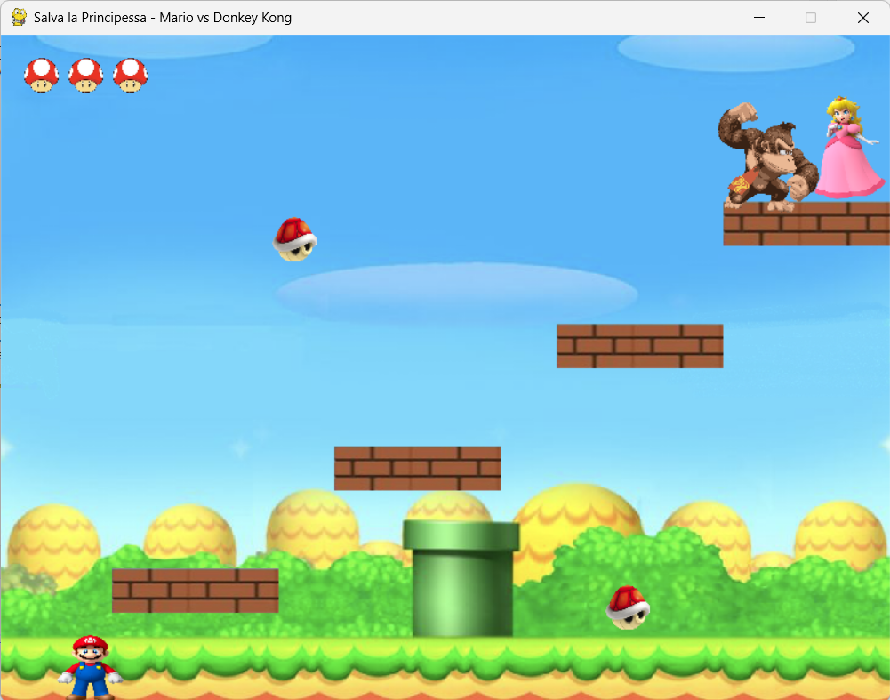
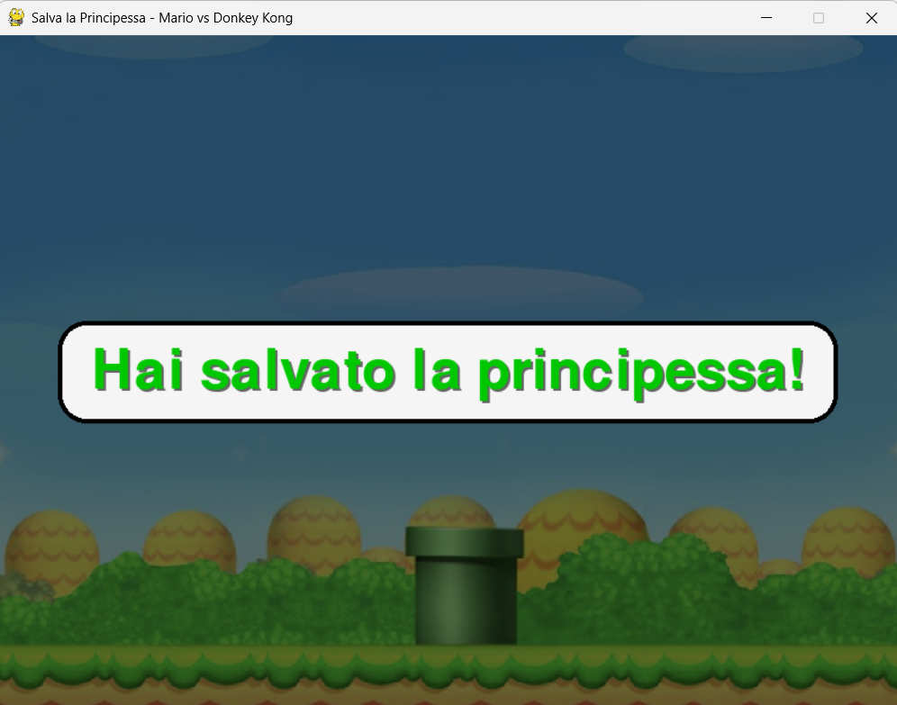

# Lezione 4: Menu, Schermate di Vittoria e Gioco Completo

# Immagini





## Introduzione

Benvenuto all’ultima lezione del corso **“Salva la Principessa”**!  
In questa fase concluderemo il nostro videogioco integrando le ultime funzionalità fondamentali:

- **Menu iniziale** per avviare la partita.  
- **Schermata di vittoria** quando Mario salva la Principessa.  
 

Alla fine, il gioco sarà completo e pienamente funzionante.

---

## Obiettivi della Lezione

1. Creare un **menu iniziale** con pulsante per cominciare.  
2. Implementare la **schermata di vittoria**.  
4. Rifinire la grafica, il flusso di gioco e le interazioni.

---

## Concetti Chiave

### 1. Struttura generale del gioco
L’applicazione ora sarà divisa in **fasi**:
- Menu principale → Gioco → Vittoria/Sconfitta → Ritorno al menu.

Questo flusso viene gestito tramite funzioni dedicate, come:
```python
main_menu()
````
per il menu iniziale
```python
game_loop()
````
per la partita
```python
victory_screen()  game_over_screen()
```
per le schermate finali

### 2. Pulsanti grafici
Per rendere il menu interattivo, creeremo pulsanti disegnati su schermo con testo centrato e bordi arrotondati.
## Esempio codice:
```python
def draw_button(rect, text, color, text_color):
    pygame.draw.rect(screen, color, rect, border_radius=15)      # rettangolo arrotondato
    pygame.draw.rect(screen, BLACK, rect, 3, border_radius=15)   # bordo nero
    label = font_small.render(text, True, text_color)            # testo del pulsante
    label_rect = label.get_rect(center=rect.center)
    screen.blit(label, label_rect)
````

E poi usiamo questa funzione nel menu:
play_button = pygame.Rect(WIDTH//2 - 120, HEIGHT//2 - 40, 240, 80)
draw_button(play_button, "GIOCA", GREEN, WHITE)

### 3. Schermate di messaggio
Le schermate di vittoria o di sconfitta mostreranno un messaggio elegante, centrato sullo schermo, con uno sfondo semitrasparente; appariranno rispettivamente quando Mario salva la principessa o quando viene colpito dai gusci prima di raggiungerla.
## Esempio codice:
```python
def show_message(text, color):
    message = font.render(text, True, color)
    text_rect = message.get_rect()
    padding_x, padding_y = 60, 40
    box_width = text_rect.width + padding_x
    box_height = text_rect.height + padding_y
    box_rect = pygame.Rect(
        (WIDTH - box_width) // 2,
        (HEIGHT - box_height) // 2,
        box_width,
        box_height
    )

    # sfondo semitrasparente
    overlay = pygame.Surface((box_width, box_height))
    overlay.set_alpha(200)
    overlay.fill(WHITE)
    screen.blit(overlay, box_rect)
    pygame.draw.rect(screen, color, box_rect, 4, border_radius=20)

    # testo centrato
    screen.blit(message, (box_rect.centerx - text_rect.width//2, box_rect.centery - text_rect.height//2))
````
Poi possiamo creare le due schermate finali:
```python
def victory_screen():
    screen.blit(background, (0, 0))
    show_message("Hai salvato la Principessa!", GREEN)


def game_over_screen():
    screen.blit(background, (0, 0))
    show_message("Non hai salvato la Principessa!", RED)
 
````
### 4. Integrazione nel gicoo:

Nel ciclo principale (game_loop) controlliamo le condizioni di vittoria o sconfitta:
```python

# Vittoria
if player.colliderect(goal):
    victory_screen()
    return
# Sconfitta
if drop_rect.colliderect(player):
            vite -= 1
            drops.remove(drop)
            if vite <= 0:
                game_over_screen()
                return

---

## Codice Completo del Gioco

Salva il seguente codice come **`salva_la_principessa.py`**  
(oppure come `lesson_4.py` se vuoi mantenere la numerazione).

```python
import pygame
import sys
import random

pygame.init()

# --- Costanti ---
WIDTH, HEIGHT = 800, 600
FPS = 60
GRAVITY = 0.8
JUMP_POWER = 20
SPEED = 5
BOUNCE_POWER = 10
DROP_SPEED_MIN = 3
DROP_SPEED_MAX = 6
DROP_SPAWN_TIME = 1200
DROPS_PER_WAVE_MIN = 1
DROPS_PER_WAVE_MAX = 2
MAX_VITE = 3

WHITE = (255, 255, 255)
RED = (255, 0, 0)
GREEN = (0, 200, 0)
BLACK = (0, 0, 0)
LIGHT_GRAY = (230, 230, 230)

# --- Setup finestra ---
screen = pygame.display.set_mode((WIDTH, HEIGHT))
pygame.display.set_caption("Salva la Principessa - Mario vs Donkey Kong")
clock = pygame.time.Clock()
font = pygame.font.SysFont(None, 72)
font_small = pygame.font.SysFont("arial", 32, bold=True)

# --- Caricamento immagini ---
mario_img = pygame.image.load("mario.png").convert_alpha()
peach_img = pygame.image.load("peach.png").convert_alpha()
orso_img = pygame.image.load("donkeykong.png").convert_alpha()
background = pygame.image.load("sfondo.png").convert()
block_img = pygame.image.load("blocco.png").convert_alpha()
guscio_img = pygame.image.load("guscio.png").convert_alpha()
cuore_img = pygame.image.load("fungo.png").convert_alpha()

# --- Ridimensionamento immagini ---
background = pygame.transform.scale(background, (WIDTH, HEIGHT))
mario_img = pygame.transform.scale(mario_img, (60, 60))
peach_img = pygame.transform.scale(peach_img, (70, 100))
orso_img = pygame.transform.scale(donkeykong_img, (100, 100))
guscio_img = pygame.transform.scale(guscio_img, (40, 40))
block_img = pygame.transform.scale(block_img, (150, 40))
cuore_img = pygame.transform.scale(cuore_img, (32, 32))

# --- Giocatore ---
player = pygame.Rect(50, HEIGHT - 150, 60, 60)
vel_y = 0
on_ground = False
vite = MAX_VITE

# --- Piattaforme ---
platforms = [
    pygame.Rect(100, 480, 150, 40),
    pygame.Rect(300, 370, 150, 40),
    pygame.Rect(500, 260, 150, 40),
    pygame.Rect(650, 150, 150, 40),
]

# --- Obiettivo (Peach e Orso) ---
goal = pygame.Rect(730, 50, 70, 100)
orso_rect = pygame.Rect(goal.x - 90, goal.y + 10, 100, 100)

# --- Gusci cadenti ---
drops = []
last_drop_time = pygame.time.get_ticks()

# --- Funzioni UI ---
def draw_button(rect, text, color, text_color):
    pygame.draw.rect(screen, color, rect, border_radius=15)
    pygame.draw.rect(screen, BLACK, rect, 3, border_radius=15)
    label = font_small.render(text, True, text_color)
    label_rect = label.get_rect(center=rect.center)
    screen.blit(label, label_rect)

def draw_vite(vite):
    x_offset = 20
    y_offset = 20
    for i in range(MAX_VITE):
        heart_x = x_offset + i * 40
        if i < vite:
            screen.blit(cuore_img, (heart_x, y_offset))
        else:
            cuore_grigio = cuore_img.copy()
            cuore_grigio.fill((120, 120, 120, 255), None, pygame.BLEND_RGBA_MULT)
            screen.blit(cuore_grigio, (heart_x, y_offset))

def show_message(text, color):
    message = font.render(text, True, color)
    text_rect = message.get_rect()
    padding_x, padding_y = 60, 40
    box_width = text_rect.width + padding_x
    box_height = text_rect.height + padding_y
    box_rect = pygame.Rect(
        (WIDTH - box_width) // 2,
        (HEIGHT - box_height) // 2,
        box_width,
        box_height
    )

    overlay = pygame.Surface((WIDTH, HEIGHT))
    overlay.set_alpha(150)
    overlay.fill((0, 0, 0))
    screen.blit(overlay, (0, 0))

    pygame.draw.rect(screen, (245, 245, 245), box_rect, border_radius=25)
    pygame.draw.rect(screen, BLACK, box_rect, 4, border_radius=25)

    shadow = font.render(text, True, (100, 100, 100))
    shadow_rect = shadow.get_rect(center=(box_rect.centerx + 2, box_rect.centery + 2))
    screen.blit(shadow, shadow_rect)

    screen.blit(message, message.get_rect(center=box_rect.center))
    pygame.display.flip()
    pygame.time.wait(3000)

def main_menu():
    while True:
        screen.blit(background, (0, 0))
        title = font.render("Salva la Principessa", True, BLACK)
        screen.blit(title, (WIDTH//2 - title.get_width()//2, 120))

        play_button = pygame.Rect(WIDTH//2 - 120, HEIGHT//2 - 40, 240, 80)
        draw_button(play_button, "GIOCA", GREEN, WHITE)

        pygame.display.flip()

        for event in pygame.event.get():
            if event.type == pygame.QUIT:
                pygame.quit()
                sys.exit()
            elif event.type == pygame.MOUSEBUTTONDOWN:
                if play_button.collidepoint(event.pos):
                    return
            elif event.type == pygame.KEYDOWN and event.key == pygame.K_RETURN:
                return

def victory_screen():
    screen.blit(background, (0, 0))
    show_message("Hai salvato la Principessa!", GREEN)

def game_over_screen():
    screen.blit(background, (0, 0))
    show_message("Non hai salvato la Principessa!", RED)

# --- Funzione principale ---
def game_loop():
    global vite, vel_y, on_ground, drops, last_drop_time
    vite = MAX_VITE
    player.x, player.y = 50, HEIGHT - 150
    vel_y = 0
    on_ground = False
    drops = []
    last_drop_time = pygame.time.get_ticks()

    running = True
    while running:
        dt = clock.tick(FPS)

        for event in pygame.event.get():
            if event.type == pygame.QUIT:
                pygame.quit()
                sys.exit()

        keys = pygame.key.get_pressed()

        # Movimento orizzontale
        if keys[pygame.K_LEFT]:
            player.x -= SPEED
            if player.left < 0:
                player.left = 0
        if keys[pygame.K_RIGHT]:
            player.x += SPEED
            if player.right > WIDTH:
                player.right = WIDTH

        # Salto
        if keys[pygame.K_SPACE] and on_ground:
            vel_y = -JUMP_POWER
            on_ground = False

        # Gravità
        vel_y += GRAVITY
        player.y += int(vel_y)

        # Collisioni
        on_ground = False
        for platform in platforms:
            if player.colliderect(platform):
                if vel_y > 0 and player.bottom - vel_y <= platform.top:
                    player.bottom = platform.top
                    vel_y = 0
                    on_ground = True
                elif vel_y < 0 and player.top - vel_y >= platform.bottom:
                    player.top = platform.bottom
                    vel_y = BOUNCE_POWER

        # Pavimento
        if player.bottom >= HEIGHT:
            player.bottom = HEIGHT
            vel_y = 0
            on_ground = True

        # Vittoria
        if player.colliderect(goal):
            victory_screen()
            return

        # Gusci
        now = pygame.time.get_ticks()
        if now - last_drop_time >= DROP_SPAWN_TIME:
            num_drops = random.randint(DROPS_PER_WAVE_MIN, DROPS_PER_WAVE_MAX)
            for _ in range(num_drops):
                x_pos = random.randint(0, WIDTH - 40)
                drops.append({"x": x_pos, "y": -40, "speed": random.randint(DROP_SPEED_MIN, DROP_SPEED_MAX)})
            last_drop_time = now

        for drop in drops[:]:
            drop["y"] += drop["speed"]
            if drop["y"] > HEIGHT:
                drops.remove(drop)
            else:
                drop_rect = pygame.Rect(drop["x"], drop["y"], 40, 40)
                if drop_rect.colliderect(player):
                    vite -= 1
                    drops.remove(drop)
                    if vite <= 0:
                        game_over_screen()
                        return
                    else:
                        player.x, player.y = 50, HEIGHT - 150
                        vel_y = 0

        # Disegno
        screen.blit(background, (0, 0))
        for platform in platforms:
            screen.blit(block_img, (platform.x, platform.y))
        screen.blit(orso_img, (orso_rect.x, orso_rect.y))
        screen.blit(peach_img, (goal.x, goal.y))
        screen.blit(mario_img, (player.x, player.y))
        for drop in drops:
            screen.blit(guscio_img, (drop["x"], drop["y"]))
        draw_vite(vite)

        pygame.display.flip()

# --- Loop principale ---
while True:
    main_menu()
    game_loop()
````

---

## Conclusione

Hai completato **Salva la Principessa**!
Ora il gioco ha:

* **Menu iniziale** con pulsante “Gioca”
* **Sistema di vite**
* **Gusci cadenti casuali**
* **Schermata di vittoria** 
* **Flusso completo di gioco**

Da qui puoi continuare a migliorarlo aggiungendo:

* Colonna sonora o effetti sonori.
* Animazioni per i personaggi.
* Punteggi o livelli di difficoltà.

**Complimenti! Hai creato il tuo primo videogioco completo in Pygame.**
